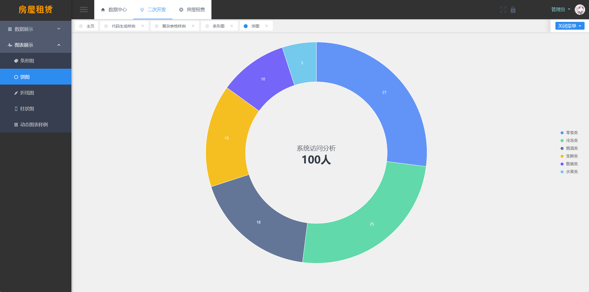

# 房屋出租出售信息系统

## 软件简介

本软件是**基于 Vue 和 SpringBoot 的房屋出租出售信息系统**，主要包含了**房屋租赁、房屋出售、房屋交易**这三条业务线，开发者可以在这个项目上进行二次开发，以满足自己的需要。


本系统采用了**基于角色的访问控制**，角色和菜单关联，一个角色可以配置多个菜单权限；然后再将用户和角色关联，一位用户可以赋予多个角色。这样用户就可以根据角色拿到该有的菜单权限，更方便管理者进行权限管控。

本系统还**封装了文件管理功能**，在其他模块如若要实现图片/文件上传预览时，前端只需导入现成的 Vue 组件即可实现（使用 viewerjs 依赖实现），后端只需定义 String 类型的实体类变量即可，无需再去研究文件上传预览的相关功能，简化了开发者的工作量。

本系统还自带**基于 beetl 代码生成器**功能，开发者只需要输入类名（如 Student）和类备注（如学生），运行 main 函数即可自动生成后端的所有 MVC 结构代码，无需开发增删改查的 API 接口。对于前端，开发者只需输入后端实体类的完整路径，利用 Java 的反射原理，拿到后端实体类的字段，即可自动生成前端所有代码，生成的模块代码包含基础的增删改查功能，简化开发者的工作量。


## 软件技术选型

### 前端

Vue：Vue 是构建前端界面的核心框架，本系统采用 2.6.14 版本。

View UI：基于 Vue.js 2 的组件库，本系统采用 4.7.0 版本。

### 后端

- Spring Boot：构建系统核心逻辑的后端框架，本系统采用 2.7.4 版本。
- MyBatis Plus：后端连接数据库的框架，本系统采用 3.5.2 版本。

### 数据库

- MySQL：本项目的主数据库，本系统采用 8.0.30 版本。
- Redis：本系统采用基于 Windows 版本的 Redis，用于图形验证码和用户菜单权限的临时存储，采用了 5.0.14.1 版本。

### 开发环境

- VsCode：项目前端的开发工具，使用版本为 1.68.0。
- IntelliJ IDEA ：项目后端的开发工具，使用版本为 2022.2.2。
- JDK：Java 的开发环境，使用版本为 17.0.5。
- Maven：后端项目的打包工具，使用版本为 3.6.2。
- NodeJs：前端项目的开发环境，使用版本为 16.13.0。

### 图表(Antv)





## 软件架构分析

基于 Vue 和 SpringBoot 的房屋出租出售信息系统包括了**房屋租赁、房屋出售、房屋交易**这三条业务线，**给房屋购买人、出售人和平台管理员使用**，其架构如下图所示。

 

接下来，分别对业务流程进行详细介绍。

## 登陆注册

登陆注册用于实现用户的登陆功能和注册功能，用户在登陆时需要输入登陆账号、密码和图形验证码，系统效验无误后即可进入系统，如如下所示。


可以用企业微信扫码登录。


当然允许新用户注册，如下图所示。


登录成功后进入首页，如下图所示。


## 房源发布

卖家/管理员首先发布房屋销售信息，如下图所示。


卖家/管理员也可以发布房屋出租信息，如下图所示。


## 买家预定

买家进入系统后，可以浏览到公开的房屋销售信息，如下图所示。


买家挑选满意的房屋后，可以下预订单，如下图所示。


预定完成后，买家可以看到自己申请的房屋销售数据，如下图所示。


当然也可以看到公开的房屋租赁信息，如下图所示。


同理，买家可以完成出租预定，如下图所示。


预定完成后，买家可以看到自己申请的房屋租赁数据，如下图所示。


## 卖家确认

买家下完房屋销售预订单后，需要卖家再次确认，如下图所示。


卖家点击每一行订单的同意即可完成确认，如下图所示。


同理，买家下完房屋租赁预订单后，也需要卖家再次确认，如下图所示。


卖家也点击每一行订单的同意即可完成确认，如下图所示。


## 买家付款

卖家再次确认后，交易成功定了下来，接下来买家就可以查到房屋销售交易单，如下图所示。


同理买家也可以查到房屋租赁的交易单，如下图所示。


记下来就可以进行付款了，如下图所示。


交易完成后，买家可查询自己的历史交易记录。


## 其他模块

系统支持维护用户，如下图所示。


系统支持维护组织架构，如下图所示。


系统支持维护文件，如下图所示。


系统支持维护日志，如下图所示。


系统支持维护数据字典，如下图所示。


## 样例代码

### 查询买家的房屋求购单

```java
@RequestMapping(value = "/getByMyPage", method = RequestMethod.GET)
@ApiOperation(value = "查询买家的房屋求购单")
public Result<IPage<CustomerSell>> getByMyPage(@ModelAttribute CustomerSell customerSell ,@ModelAttribute PageVo page){
    QueryWrapper<CustomerSell> qw = new QueryWrapper<>();
    qw.eq("user_id",securityUtil.getCurrUser().getId());
    if(customerSell.getStatus() > -1) {
        qw.eq("status",customerSell.getStatus());
    }
    if(!ZwzNullUtils.isNull(customerSell.getHouseType())) {
        qw.inSql("id","select id from t_customer_sell where house_id in (select id from t_house_sell where house_type like '%" + customerSell.getHouseType() + "%')");
    }
    if(!ZwzNullUtils.isNull(customerSell.getAddress())) {
        qw.inSql("id","select id from t_customer_sell where house_id in (select id from t_house_sell where address like '%" + customerSell.getAddress() + "%')");
    }
    if(!ZwzNullUtils.isNull(customerSell.getUserName())) {
        qw.inSql("id","select id from t_customer_sell where user_id in (select id from a_user where nickname like '%" + customerSell.getUserName() + "%')");
    }
    IPage<CustomerSell> data = iCustomerSellService.page(PageUtil.initMpPage(page),qw);
    for (CustomerSell sell : data.getRecords()) {
        HouseSell houseSell = iHouseSellService.getById(sell.getHouseId());
        sell = HouseVoChangeUtils.fillCustomerSellByHouseSell(sell,houseSell);
        User user = iUserService.getById(sell.getUserId());
        sell = HouseVoChangeUtils.fillCustomerSellByUser(sell,user);
    }
    return new ResultUtil<IPage<CustomerSell>>().setData(data);
}
```

### 新增房屋出售单

```java
@RequestMapping(value = "/insert", method = RequestMethod.POST)
@ApiOperation(value = "新增房屋出售单")
public Result<HouseSell> insert(HouseSell houseSell) {
    houseSell.setSellerId(securityUtil.getCurrUser().getId());
    String mobile = houseSell.getMobile();
    if(!ZwzNullUtils.isNull(mobile)) {
        QueryWrapper<User> qw = new QueryWrapper<>();
        qw.eq("mobile",mobile);
        List<User> userList = iUserService.list(qw);
        if(userList.size() > 0) {
            houseSell.setSellerId(userList.get(0).getId());
        }
    }
    iHouseSellService.saveOrUpdate(houseSell);
    return new ResultUtil<HouseSell>().setData(houseSell);
}
```

### 房屋租赁单审核

```java
@RequestMapping(value = "/pass", method = RequestMethod.POST)
@ApiOperation(value = "审核")
public Result<Object> pass(@RequestParam String id){
    HouseLease se = iHouseLeaseService.getById(id);
    if(se == null) {
        return ResultUtil.error("不存在");
    }
    se.setStatus(0);
    iHouseLeaseService.saveOrUpdate(se);
    return ResultUtil.success();
}
```

### 前端房屋录入表单

```javascript
<Form ref="form" :model="form" :label-width="100" :rules="formValidate" label-position="left">
    <FormItem label="户型" prop="houseType">
        <Select v-model="form.houseType" clearable style="width:570px">
            <Option value="单身公寓">单身公寓</Option>
            <Option value="三室一厅">三室一厅</Option>
            <Option value="四室一厅">四室一厅</Option>
            <Option value="五室两厅">五室两厅</Option>
            <Option value="其他">其他</Option>
        </Select>
    </FormItem>
    <FormItem label="面积（平方）" prop="houseSize">
        <InputNumber v-model="form.houseSize" min="0" max="5000000" style="width:570px"></InputNumber>
    </FormItem>
    <FormItem label="价格（万元）" prop="houseMoney">
        <InputNumber v-model="form.houseMoney" min="0" max="5000000" style="width:570px"></InputNumber>
    </FormItem>
    <FormItem label="房屋图片" prop="imageUrl">
        <upload-pic-input v-model="form.imageUrl" style="width:570px"></upload-pic-input>
    </FormItem>
    <FormItem label="电话" prop="mobile">
        <Input v-model="form.mobile" clearable style="width:570px" />
    </FormItem>
    <FormItem label="联系人" prop="houseOwner">
        <Input v-model="form.houseOwner" clearable style="width:570px" />
    </FormItem>
    <FormItem label="地址" prop="address">
        <Input v-model="form.address" clearable style="width:570px" />
    </FormItem>
    <FormItem label="备注" prop="remark">
        <Input v-model="form.remark" type="textarea" :rows="4" clearable style="width:570px" />
    </FormItem>
    <Form-item class="br">
        <Button @click="handleSubmit" :loading="submitLoading" type="primary">提交并保存</Button>
        <Button @click="handleReset">重置</Button>
        <Button type="dashed" @click="close">关闭</Button>
    </Form-item>
</Form>
```

## 免责声明

- 本项目开源，仅供个人学习使用，遵循 GPL-3.0 开源协议，**转发 / 商用授权请联系作者，否则后果自负**。
- 作者拥有本软件构建后的应用系统全部内容所有权及独立的知识产权。
- 如有问题，欢迎在仓库 Issue 留言，看到后会第一时间回复。相关意见会酌情考虑，但没有一定被采纳的承诺或保证。

下载本系统代码的用户，**必须同意以下内容，否则请勿下载**！

1. 出于自愿而使用/开发本软件，了解使用本软件的风险，且同意自己承担使用本软件的风险。
2. 利用本软件构建的网站的任何信息内容以及导致的任何版权纠纷和法律争议及后果和作者无关，作者对此不承担任何责任。
3. 在任何情况下，对于因使用或无法使用本软件而导致的任何难以合理预估的损失（包括但不仅限于商业利润损失、业务中断与业务信息丢失），作者概不承担任何责任。
4. 必须了解使用本软件的风险，作者不承诺提供一对一的技术支持、使用担保，也不承担任何因本软件而产生的难以预料的问题的相关责任。
